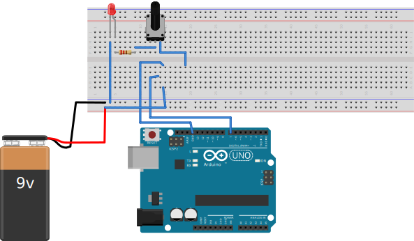
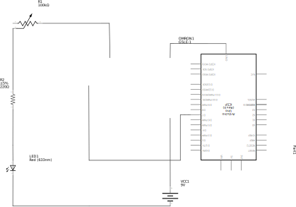

Light Automation System
=======================

Nearly every room contains several lights which need to be adjusted regularly in response to
various stimuli. It is very common for occupants to forget to turn off lights when they are
not in use, leading to and unnecessary waste of money and energy. In order to save money and
energy, the home automation system should be capable of automating the following tasks:

* Turn on lights at a given time
* Turn off lights at a given time
* Turn on lights when dark outside
* Turn off lights when light outside

## Button Circuit

### Diagram

### Schematic

## Relay Circuit

### Diagram

### Schematic

